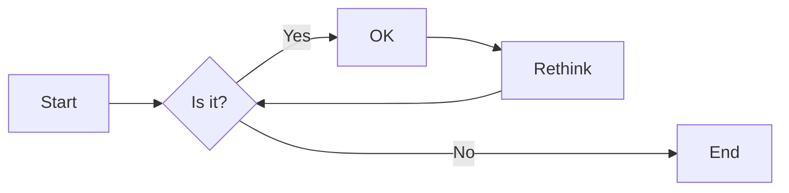
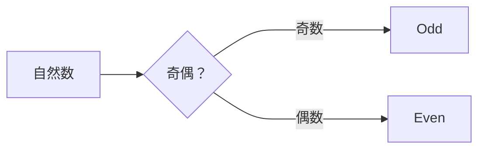

# 实验二 Python变量、简单数据类型

班级： 21计科04

学号： B20210502235

姓名： 高楷皓

Github地址：https://github.com/Sgran777/Python_Resource

CodeWars地址：https://www.codewars.com/users/Sgran777

## 实验目的

1. 使用VSCode编写和运行Python程序
2. 学习Python变量和简单数据类型

## 实验环境

1. Git
2. Python 3.10
3. VSCode
4. VSCode插件

## 实验内容和步骤

### 第一部分

实验环境的安装

1. 安装Python，从Python官网下载Python 3.10安装包，下载后直接点击可以安装：[Python官网地址](https://www.python.org/downloads/)
2. 为了在VSCode集成环境下编写和运行Python程序，安装下列VScode插件
   - Python
   - Python Environment Manager
   - Python Indent
   - Python Extended
   - Python Docstring Generator
   - Jupyter
   - indent-rainbow
   - Jinja

---

### 第二部分

Python变量、简单数据类型和列表简介

完成教材《Python编程从入门到实践》下列章节的练习：

- 第2章 变量和简单数据类型

---

### 第三部分

在[Codewars网站](https://www.codewars.com)注册账号，完成下列Kata挑战：

---

#### 第1题：求离整数n最近的平方数（Find Nearest square number）

难度：8kyu

你的任务是找到一个正整数n的最近的平方数
例如，如果n=111，那么nearest_sq(n)（nearestSq(n)）等于121，因为111比100（10的平方）更接近121（11的平方）。
如果n已经是完全平方（例如n=144，n=81，等等），你需要直接返回n。
代码提交地址
<https://www.codewars.com/kata/5a805d8cafa10f8b930005ba>

---

#### 第2题：弹跳的球（Bouncing Balls）

难度：6kyu

一个孩子在一栋高楼的第N层玩球。这层楼离地面的高度h是已知的。他把球从窗口扔出去。球弹了起来,  例如:弹到其高度的三分之二（弹力为0.66）。他的母亲从离地面w米的窗户向外看,母亲会看到球在她的窗前经过多少次（包括球下落和反弹的时候）？

一个有效的实验必须满足三个条件：

- 参数 "h"（米）必须大于0
- 参数 "bounce "必须大于0且小于1
- 参数 “window "必须小于h。

如果以上三个条件都满足，返回一个正整数，否则返回-1。
**注意:只有当反弹球的高度严格大于窗口参数时，才能看到球。**
代码提交地址
<https://www.codewars.com/kata/5544c7a5cb454edb3c000047/train/python>

---

#### 第3题： 元音统计(Vowel Count)

难度： 7kyu

返回给定字符串中元音的数量（计数）。对于这个Kata，我们将考虑a、e、i、o、u作为元音（但不包括y）。输入的字符串将只由小写字母和/或空格组成。

代码提交地址：
<https://www.codewars.com/kata/54ff3102c1bad923760001f3>

---

#### 第4题：偶数或者奇数（Even or Odd）

难度：8kyu

创建一个函数接收一个整数作为参数，当整数为偶数时返回”Even”当整数位奇数时返回”Odd”。
代码提交地址：
<https://www.codewars.com/kata/53da3dbb4a5168369a0000fe>

### 第四部分

使用Mermaid绘制程序流程图

安装Mermaid的VSCode插件：

- Markdown Preview Mermaid Support
- Mermaid Markdown Syntax Highlighting

使用Markdown语法绘制你的程序绘制程序流程图（至少一个），Markdown代码如下：


显示效果如下：



查看Mermaid流程图语法-->[点击这里](https://mermaid.js.org/syntax/flowchart.html)

使用Markdown编辑器（例如VScode）编写本次实验的实验报告，包括[实验过程与结果](#实验过程与结果)、[实验考查](#实验考查)和[实验总结](#实验总结)，并将其导出为 **PDF格式** 来提交。

## 实验过程与结果

请将实验过程与结果放在这里，包括：

- [第二部分 Python变量、简单数据类型和列表简介](#第二部分)

* 练习2.3
```python
  name='gkh'
  print(f"Hello {name},would you like to learn Python today?")
```

```
Hello gkh,would you like to learn Python today?
```
* 练习2.4
 ```python
name='gkh'
print(name.title())
print(name.upper())
print(name.lower())
 ```
```
Gkh
GKH
gkh
```
* 练习2.5
```python
str="ALbert once said:“A person who never made a mistake never tried anything new”"
print(str)
```
```
ALbert once said:“A person who never made a mistake never tried anything new”
```
* 练习2.6
```python
name="ALbert once said"
message="A person who never made a mistake never tried anything  new"
print(name+message)
```
```
ALbert once said:“A person who never made a mistake never tried anything new”
```
* 练习2.7
```python
name= ' \t gkh \n '
print(name)
name.rstrip()
name.lstrip()
name.strip()
print(name)
```
```
 	 gkh
 
 	 gkh
```
* 练习2.8
```python
filename='python_notes.txt'
print(filename.removesuffix('.txt'))

```
```
python_notes
```
- [第三部分 Codewars Kata挑战](#第三部分)
* 第1题：求离整数n最近的平方数（Find Nearest square number）
```python
def nearest_sq(n):
    # pass
    n=round(pow(n,0.5))
    return n*n
```
* 第2题：弹跳的球（Bouncing Balls）
```python
def bouncing_ball(h, bounce, window):
    # your code
    if bounce >=1 or bounce<=0 or h<=0 or window>=h:
        return -1
    time=1
    while h*bounce > window :
        h*=bounce
        time+=2
    return time
        
```
* 第3题： 元音统计(Vowel Count)
```python
def get_count(sentence):
    ans =0
    for i in sentence:
        if i =='a' or i =='e' or i =='i' or i =='o' or i =='u':
            ans+=1
    return ans
    
    pass

```
* 第4题：偶数或者奇数（Even or Odd）
```python
def even_or_odd(number):
    if number&1:
        return "Odd"
    else:
        return "Even"
```
- [第四部分 使用Mermaid绘制程序流程图](#第四部分)
* 偶数或奇数


  

注意代码需要使用markdown的代码块格式化，例如Git命令行语句应该使用下面的格式：


显示效果如下：

```bash
git init
git add .
git status
git commit -m "first commit"
```

如果是Python代码，应该使用下面代码块格式，例如：


显示效果如下：

```python
def add_binary(a,b):
    return bin(a+b)[2:]
```

代码运行结果的文本可以直接粘贴在这里。

**注意：不要使用截图，Markdown文档转换为Pdf格式后，截图可能会无法显示。**

## 实验考查

请使用自己的语言并使用尽量简短代码示例回答下面的问题，这些问题将在实验检查时用于提问和答辩以及实际的操作。

1. Python中的简单数据类型有那些？我们可以对这些数据类型做哪些操作？
* 整数，浮点数，布尔值，字符串，空；
* 进行增删改查。
2. 为什么说Python中的变量都是标签？
  *  当我们为一个变量赋值时，实际上是在创建一个对象并将该对象的引用赋给了这个变量。这个对象可以是任何数据类型，例如整数、字符串、列表等等。因此，变量只是对内存中某个对象的引用，相当于给这个对象贴上了一个标签。
3. 有哪些方法可以提高Python代码的可读性？
   * 1.命名规范
   * 2.注释
   * 3.模块组织
   * 4.代码缩进
   * 5.适当的换行和空格
  

## 实验总结

总结一下这次实验你学习和使用到的知识，例如：编程工具的使用、数据结构、程序语言的语法、算法、编程技巧、编程思想。
